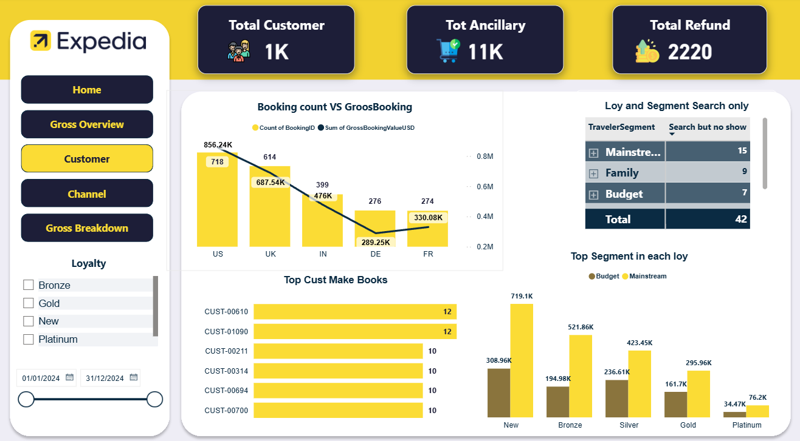
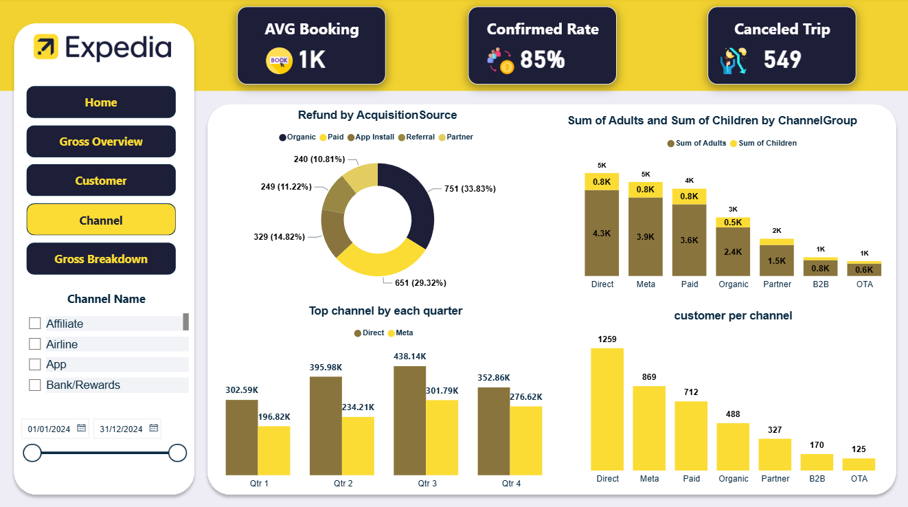

 ## Dashboard Modules

### Gross Overview

This page provides a high-level view of overall business performance through key financial and operational metrics.

Key insights include:

* Gross Booking Value
* Net Margin
* Booking Count
* Revenue Trends by Month
* Revenue by Supplier Type
* Revenue by Product Type
* Booking Status Distribution

The page helps identify the main drivers of revenue and profitability across the travel business.

---

### Customer Analysis

This section focuses on customer behavior and customer value analysis.

Key analyses include:

* Total Customers
* Total Ancillary Revenue
* Total Refund Amount
* Gross Booking vs Booking Count Comparison
* Loyalty Tier Performance
* Segment Performance by Loyalty Group
* Top Customers by Booking Activity
* Top Segments within Each Loyalty Tier

The objective is to understand customer contribution, loyalty impact, and booking behavior patterns.

---

### Channel Analysis

This page evaluates acquisition channel performance and booking quality.

Custom DAX measures were developed for:

* Average Booking Value
* Confirmed Booking Rate
* Cancelled Trip Rate

Additional analyses include:

* Refund Amount by Acquisition Source
* Adults and Children Distribution by Channel Group
* Top Performing Channel by Quarter
* Customer Distribution by Channel

This analysis helps measure channel effectiveness and customer acquisition performance.

---

### Gross Breakdown

This page provides a detailed breakdown of revenue generation and operational performance.

Key analyses include:

* Revenue by Device Type
* Device Performance vs Booking Status
* Revenue Breakdown by Product Type
* Regional Performance Analysis
* Channel Group Contribution
* Supplier Type Analysis

A hierarchical decomposition tree was implemented to enable interactive root-cause analysis across multiple business dimensions.

## Data Model

A Star Schema data model was designed to improve performance, simplify relationships, and support scalable analysis.

The model consists of:

### Fact Tables

* Fact_Bookings
* Fact_Searches

### Dimension Tables

* Customer Dimension
* Product Dimension
* Channel Dimension
* Device Dimension
* Market Dimension

The data model was optimized to support cross-filtering, KPI calculations, and interactive dashboard navigation.

---

## Technical Implementation

### Data Preparation

* Data Cleaning
* Data Transformation
* Data Validation
* Data Type Standardization

### DAX Measures

Custom measures were created to calculate:

* Net Margin
* Confirmed Rate
* Cancelled Trip Rate
* Average Booking Value
* Gross Booking Metrics
* Customer Performance Metrics

### Visualization Techniques

* KPI Cards
* Interactive Slicers
* Navigation Buttons
* Decomposition Tree
* Trend Analysis
* Comparative Analysis
* Dynamic Filtering

---

## Skills Demonstrated

* Power BI Development
* Data Modeling
* DAX
* Power Query
* Business Intelligence
* KPI Design
* Dashboard Design
* Data Visualization
* Analytical Thinking

---

## Dashboard Preview

### Home Page

---

### Gross Overview

---

### Customer Analysis

---

### Channel Analysis

---

### Revenue Breakdown

---

### Data Model

